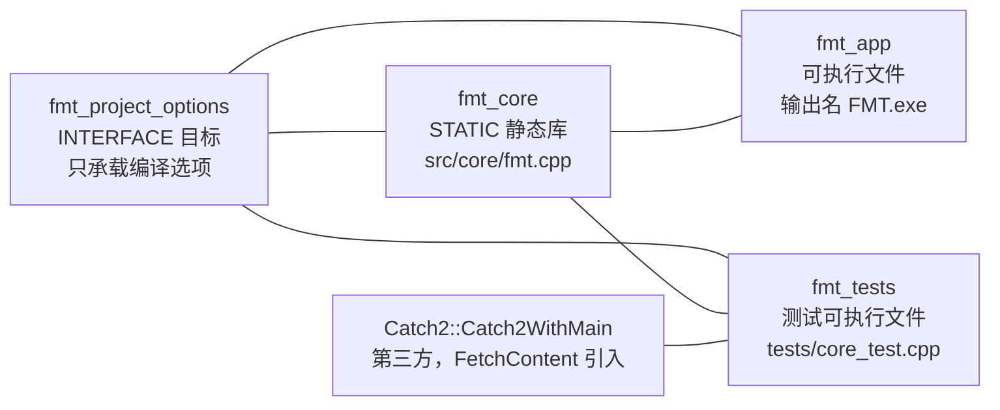

# FMT 项目架构

> 本文档描述**当前仓库的真实状态**，即 C++20 / CMake 工程骨架阶段。
> 骨架中只有版本信息这一个真实功能符号，业务模块尚未实现——业务架构待
> `docx/` 下的需求与设计文档产出后再补充。
>
> 最后更新：对应 `dev` 分支提交 `a6bb5f2`。

---

## 1. 设计原则

骨架围绕四条约束组织，后续新增代码应延续这些约定：

1. **可执行文件不承载逻辑。** 除入口解析外的一切代码都放进 `fmt_core` 库，
   这样单元测试链接的是应用真正运行的那份目标代码，而不是复制品。
2. **公共头文件与实现分离。** 对外可见的头文件集中在 `include/fmt/`，实现放
   `src/`。`include/` 是库的公开契约边界，改动它等于改动对外 API。
3. **版本号单一来源。** 版本只在 `CMakeLists.txt` 的 `project(VERSION ...)` 里
   定义一次，头文件由 CMake 生成，杜绝两处不一致。
4. **平台差异集中在构建脚本。** 编译器警告、安装路径等差异由 CMake 分支处理，
   源码中不出现平台判断。

---

## 2. 目录结构

```
FMT/
├── CMakeLists.txt              顶层构建脚本：全局设置、版本头生成、子目录编排
├── CMakePresets.json           本地构建预设（MSVC / MinGW，Ninja，共用 cmake-build-debug）
├── .gitignore                  忽略构建产物、IDE 配置、编译中间文件
├── README.md                   （待撰写）
├── FMT 开发文档.md              （待撰写）
├── FMT 项目架构.md              本文档
│
├── .github/
│   └── workflows/
│       └── ci.yml              GitHub Actions：Windows / Linux 双平台构建与测试
│
├── cmake/
│   └── version.hpp.in          版本头模板，经 configure_file 生成
│
├── include/
│   └── fmt/
│       └── core.hpp            fmt_core 的公共 API 声明
│
├── src/
│   ├── core/
│   │   ├── CMakeLists.txt      定义静态库目标 fmt_core
│   │   └── fmt.cpp             fmt_core 的实现
│   └── app/
│       ├── CMakeLists.txt      定义可执行目标 fmt_app
│       └── main.cpp            程序入口：参数解析与错误处理
│
├── tests/
│   ├── CMakeLists.txt          FetchContent 拉取 Catch2，注册 CTest 用例
│   └── core_test.cpp           fmt_core 的单元测试
│
├── tools/
│   └── .gitkeep                开发脚本目录（占位，暂无内容）
├── resources/
│   └── .gitkeep                运行时数据文件目录（占位，暂无内容）
└── docx/
    ├── .gitkeep
    └── 项目基本提示词.txt       （空文件）
```

`tools/`、`resources/`、`docx/` 三个目录目前没有真实文件，靠 `.gitkeep`
占位保留在版本控制中——git 本身不追踪空目录。这些目录产生真实内容后，
`.gitkeep` 即可删除。

---

## 3. 构建目标与依赖关系

整个工程产生三个 CMake 目标：



| 目标 | 类型 | 源文件 | 产出 |
|---|---|---|---|
| `fmt_project_options` | INTERFACE | 无 | 仅传播编译选项，不产出文件 |
| `fmt_core` | STATIC | `src/core/fmt.cpp` | `libfmt_core.a` / `fmt_core.lib` |
| `fmt_app` | 可执行 | `src/app/main.cpp` | `bin/FMT.exe`（`OUTPUT_NAME` 设为 `FMT`） |
| `fmt_tests` | 可执行 | `tests/core_test.cpp` | `bin/fmt_tests.exe` |

依赖方向严格单向：`fmt_app` 和 `fmt_tests` 依赖 `fmt_core`，`fmt_core`
不反向依赖任何本工程目标。`fmt_core` 另有一个带命名空间别名
`fmt::fmt_core`，供日后作为子项目被外部 `add_subdirectory` 引入时使用。

---

## 4. 构建系统

### 4.1 顶层编排

[`CMakeLists.txt`](CMakeLists.txt) 按顺序完成四件事：

1. **工程声明** —— `project(FMT VERSION 0.1.0 LANGUAGES CXX)`。只启用 CXX，
   未启用 C，因此不需要配置 C 编译器。
2. **全局设置** —— 锁定 C++20（`CMAKE_CXX_STANDARD_REQUIRED ON`、
   `CMAKE_CXX_EXTENSIONS OFF`，即禁用 GNU 扩展）；所有产物集中到
   `<build>/bin`；开启 `compile_commands.json` 导出以支持 clangd；
   单配置生成器下默认 `Debug`。
3. **版本头生成** —— 将 `cmake/version.hpp.in` 中的 `@PROJECT_VERSION_*@`
   占位符替换后写入 `<build>/generated/fmt/version.hpp`。该文件在构建目录中
   生成，**不在源码树内**，因此不应也不会被提交。
4. **子目录编排** —— 依次进入 `src/core`、`src/app`；`tests` 仅在
   `BUILD_TESTING` 为真时进入，这是 Catch2 不被下载的唯一开关。

末尾输出一行配置摘要，便于在构建日志中快速确认生效的配置。

### 4.2 编译警告策略

警告选项集中在 INTERFACE 目标 `fmt_project_options` 上，避免每个目标重复书写：

| 编译器 | 选项 |
|---|---|
| MSVC | `/W4 /permissive- /utf-8` |
| GCC / Clang | `-Wall -Wextra -Wpedantic -Wshadow -Wconversion` |

三者都以 `PRIVATE` 方式链接该目标，因此警告只施加于自身源码，不会传播给
链接它们的下游目标。`/utf-8` 是必需的：源码含 UTF-8 中文注释，缺少该选项时
MSVC 在中文代码页下会误报 C4819 或产生乱码。

### 4.3 依赖引入方式

唯一的第三方依赖 Catch2 通过 `FetchContent` 在配置阶段拉取：

- 固定在 tag `v3.7.1`，可用 `-DFMT_CATCH2_TAG=...` 覆盖；
- `GIT_SHALLOW TRUE` 只取最新一次提交，实测克隆体积约 9 MB；
- `SYSTEM` 使其头文件按系统头处理，不触发本项目的警告；
- 测试源码内嵌在 `tests/CMakeLists.txt` 中，只能通过关闭 `BUILD_TESTING`
  来跳过拉取。

本地多次实测首次配置耗时 283～641 秒，差异全部来自这次网络拉取，与编译无关
（同样的配置在缓存命中时仅需约 2 秒）；构建目录建立后会复用，不会重复下载。

### 4.4 安装规则

`fmt_core` 具备安装规则，可被其他项目消费：

- 库文件 → `${CMAKE_INSTALL_LIBDIR}`（由 `GNUInstallDirs` 决定）
- `include/` 下全部头文件 → `${CMAKE_INSTALL_INCLUDEDIR}`
- 生成版本头 → `${CMAKE_INSTALL_INCLUDEDIR}/fmt`

目前尚未导出 CMake 包配置（`FMTConfig.cmake`），因此外部项目还不能用
`find_package(FMT)` 直接消费，只能通过 `add_subdirectory` 引入。

---

## 5. 源码组织

### 5.1 公共 API

[`include/fmt/core.hpp`](include/fmt/core.hpp) 当前只声明两个函数：

| 声明 | 说明 |
|---|---|
| `std::string_view fmt::version_string()` | 返回 `0.1.0` 形式的版本字符串 |
| `std::string fmt::banner()` | 返回 `FMT 0.1.0` 形式的单行标识 |

两者都标注 `[[nodiscard]]`，忽略返回值会产生警告。这个 API 面是**临时占位**：
它的唯一作用是让骨架有一条完整的「声明 → 实现 → 链接 → 测试」链路可验证。
需求明确后应整体替换或扩展。

引入的公共头文件集中在 `include/fmt/` 下并按 `<fmt/xxx.hpp>` 形式引用，
保证安装后使用方式与源码树内一致。

### 5.2 版本信息

[`cmake/version.hpp.in`](cmake/version.hpp.in) 生成如下内容：

```cpp
namespace fmt::version {
inline constexpr std::string_view MAJOR = "0";
inline constexpr std::string_view MINOR = "1";
inline constexpr std::string_view PATCH = "0";
inline constexpr std::string_view STRING = "0.1.0";
}
```

全部为 `constexpr`，无运行期开销，可直接用于常量表达式。`STRING` 与三个
分量之间的一致性由 CMake 保证——它们同源于 `project(VERSION 0.1.0)`。

> **改名提示：** 命名空间 `fmt` 与知名第三方格式化库 {fmt} 同名。若日后引入
> 该库（常见于日志、字符串格式化场景），会与此命名空间产生冲突。建议在业务
> 模块铺开前决定是否改为更具体的名字，例如 `fmtproject` 或项目正式全称的缩写。

### 5.3 程序入口

[`src/app/main.cpp`](src/app/main.cpp) 只做参数解析与错误处理，不含业务逻辑：

| 参数 | 行为 | 退出码 |
|---|---|---|
| 无参数 | 打印 `fmt::banner()` | 0 |
| `-h` / `--help` | 打印用法说明 | 0 |
| `-v` / `--version` | 打印 `fmt::version_string()` | 0 |
| 未知参数 | 向 stderr 报错并打印用法 | 2 |
| 抛出异常 | 向 stderr 打印 `fatal: <what>` | 1 |

用法文本以匿名命名空间内的 `constexpr std::string_view kUsage` 集中定义。
整个 `main` 体包裹在 `try/catch` 中，确保异常不会逃逸出程序边界。

> 当前为顺序遍历多个参数，遇到第一个未知参数即返回。若后续需要多子命令
> （如 `FMT build`、`FMT run`）或更复杂的选项组合，建议引入专用解析库而非
> 手工扩展此处逻辑。

### 5.4 测试

[`tests/core_test.cpp`](tests/core_test.cpp) 包含 3 个用例：

| 用例 | 断言内容 |
|---|---|
| `version_string matches the generated version header` | `version_string()` 与 `version::STRING` 一致且非空 |
| `version components are numeric` | 三个版本分量均非空且全为数字字符 |
| `banner contains the version` | 以 `FMT ` 开头且包含版本字符串 |

用例通过 `catch_discover_tests` 注册为独立 CTest 测试项，因此 CTest 能逐条
报告通过/失败，而不是把整个测试可执行文件当成黑盒。

新增模块时应遵循「一个模块一个测试源文件」的约定，并在
[`tests/CMakeLists.txt`](tests/CMakeLists.txt) 的 `add_executable` 中登记。

---

## 6. 构建与开发流程

### 6.1 环境要求

| 项 | 要求 |
|---|---|
| CMake | ≥ 3.20（本机验证版本 3.31.6） |
| C++ 标准 | C++20（严格模式，禁用 GNU 扩展） |
| 编译器 | MSVC 14.51（VS 2026 BuildTools）实测通过；MinGW g++ 15.1 实测通过 |
| 构建后端 | Ninja（未安装 Ninja 也可用 Makefiles / 其他生成器） |
| 网络 | 首次配置需访问 github.com 拉取 Catch2 |
| 构建目录 | 仅 `cmake-build-debug/`，不入版本控制 |
| 磁盘占用 | 单个 Debug 构建目录约 150 MB（含 Catch2 源码与库） |
| 首次配置耗时 | 实测 283～641 秒，取决于网络（下载 Catch2 约 9 MB），与编译无关 |

`cmake_minimum_required` 定为 3.20 而非更高版本：骨架只用到
`configure_file`、`FetchContent`、CTest 这些 3.20 已具备的能力。这个下限
同时保证 `ubuntu-latest` 等常见 CI 镜像自带的 CMake 可以直接配置成功。

### 6.2 本地构建

工程只保留**一个**构建目录 `cmake-build-debug/`。这一点是刻意的，有三重考量：
避免磁盘上堆积多份重复的依赖与中间产物、避免 CMake 缓存与生成器配置互相干扰、
让 CLion 与命令行落在同一处而看不到「两份不一致的构建结果」。

CLion 的默认 `Debug` 配置本就用这个目录（生成器 Ninja）。为了让命令行预设与它
对齐，[`CMakePresets.json`](CMakePresets.json) 中三套预设的 `binaryDir` 都指向
这同一个目录：

| 预设 | 生成器 | 编译器 | 构建类型 | 测试 |
|---|---|---|---|---|
| `msvc-debug` | Ninja | `cl`（显式指定） | Debug | 开启 |
| `msvc-release` | Ninja | `cl`（显式指定） | Release | 开启 |
| `mingw-debug` | Ninja | MinGW g++（绝对路径） | Debug | 开启 |

```powershell
cmake --preset msvc-debug                    # 配置（复用 cmake-build-debug）
cmake --build --preset msvc-debug            # 编译
ctest --preset msvc-debug                    # 测试
```

**注意事项：**

- **切换预设前先清空目录。** 三套预设共用 `cmake-build-debug`，而 CMake 缓存中的
  编译器与构建类型是**粘性**的：在已配置好的目录里换预设，CMake 会忽略新的
  `CMAKE_BUILD_TYPE` 而沿用旧缓存，或者直接报工具链不一致。需要切换时先删除该
  目录（或另给一个 `-B` 目录）：
  ```powershell
  Remove-Item cmake-build-debug -Recurse -Force
  cmake --preset mingw-debug
  ```
- **不要与正在构建的 CLion 同时操作同一目录。** 两边并发写入 `cmake-build-debug`
  会破坏 CMake 缓存状态。命令行配置期间请让 CLion 处于空闲，或先在 CLion 中
  停止当前构建。
- Ninja 需要 MSVC 环境变量（`cl`、`link` 在 PATH 中）。请在 *Visual Studio
  开发者命令行* 中执行，或直接使用 CLion 打开项目并选择 `Debug` 配置。
- 预设中显式写入了 `CMAKE_CXX_COMPILER=cl`。这不是冗余：Ninja 生成器在
  PATH 中同时存在 g++ 时可能优先选中它，显式指定可避免误用编译器。
- `mingw-debug` 里是 `D:/MinGW/MinGW-win64-v12.0.0/bin/` 这样的**本机绝对
  路径**，换一台机器或换 MinGW 版本都会失效。这个预设是给本机用的备用
  工具链，不打算跨机复用；需要跨机时应改用环境变量或工具链文件。

不使用预设时的等价命令：

```powershell
cmake -S . -B cmake-build-debug -G Ninja -DCMAKE_BUILD_TYPE=Debug -DBUILD_TESTING=ON
cmake --build cmake-build-debug --parallel
ctest --test-dir cmake-build-debug --output-on-failure
```

`-B` 的目录名建议保持 `cmake-build-debug`，与上文约定一致。

### 6.3 持续集成

[`.github/workflows/ci.yml`](.github/workflows/ci.yml) 在 push 到 `main`、
`dev`、`feature/**` 以及向 `main`、`dev` 发起 PR 时触发，执行流水线：

```
checkout → 安装 CMake/Ninja → 配置 → 编译 → ctest → 可执行文件冒烟测试
```

- 矩阵：`windows-latest` + MSVC、`ubuntu-latest` + GCC，`fail-fast: false`
  保证一个平台失败不影响另一个平台的结果。
- CMake 版本固定为 `3.31.x`（与本机验证版本一致），避免 CMake 4.x 的兼容
  策略变更引入未经本机验证的行为。
- 冒烟测试直接调用 `./build/bin/FMT --version` 与 `--help`，验证真实产物的
  运行行为，而不只是「能编译」。
- 同一分支的旧运行会被自动取消（`concurrency`）。

### 6.4 分支与仓库状态约定

| 分支 | 定位 |
|---|---|
| `main` | 稳定分支，只接受经 PR 合入的成果 |
| `dev` | 集成分支，日常开发在此进行 |

当前 `dev` 领先 `main` 一个提交（工程骨架）。功能开发完成后从 `dev` 向
`main` 发起 PR。

**构建目录约定：** 磁盘上只保留 `cmake-build-debug/`，任何其他构建目录都属于
临时产物，用完即删。该目录由 [`.gitignore`](.gitignore) 中的 `cmake-build-*/`
规则覆盖，不会进入版本控制。

**IDE 配置约定：** `.idea/` 目前**不纳入**版本控制——其中
`workspace.xml` 记录的是个人窗口布局、构建配置与最近文件等本机状态，
`.idea/.gitignore`（CLion 生成）本身也忽略了它。是否需要像常见 C++ 工程那样
提交 `misc.xml`、`modules.xml` 等共享配置，见 7.2 待决事项。

---

## 7. 扩展指引

### 7.1 新增一个模块

以新增 `parser` 模块为例，需要改动 4 处：

1. 新增公共头文件 `include/fmt/parser.hpp`；
2. 新增实现 `src/core/parser.cpp`，并加入
   [`src/core/CMakeLists.txt`](src/core/CMakeLists.txt) 的 `add_library` 源文件列表；
3. 新增测试 `tests/parser_test.cpp`，并加入
   [`tests/CMakeLists.txt`](tests/CMakeLists.txt) 的 `add_executable` 源文件列表；
4. 无需改动顶层 `CMakeLists.txt`——子目录已在其中登记。

这是骨架最重要的可扩展性设计：新增业务代码只需在既有子目录内追加文件，
顶层构建脚本不必再动。

### 7.2 待决事项

以下问题需在业务模块铺开前确定，均为当前骨架未覆盖的部分：

| 事项 | 说明 |
|---|---|
| 项目定位与需求 | 三份文档（`README.md`、`FMT 开发文档.md`、`docx/项目基本提示词.txt`）目前均为空 |
| 命名空间命名 | `fmt` 与第三方库 {fmt} 冲突风险，见 5.2 |
| 第三方依赖策略 | 目前仅 Catch2 且用 `FetchContent`；依赖变多后需决定是否转向 vcpkg / Conan |
| 包导出 | 尚未提供 `FMTConfig.cmake`，外部项目无法 `find_package(FMT)` |
| 编译器矩阵 | 仅验证 MSVC 与 MinGW；Clang 未验证 |
| 测试覆盖 | 当前仅覆盖版本信息，被测逻辑本身是占位代码 |
| 文档落位 | 架构文档在根目录，开发文档亦在根目录；内容增多后建议移入 `docx/` 并建立索引 |
| 构建目录 | 现为单一 `cmake-build-debug/`，切换预设需手工清空；若日后需要并行保存 Debug/Release 产物，需重新划分目录并在本文档 6.2 记录 |
| IDE 配置 | `.idea/` 当前整体不入版本控制，团队协作时是否提交共享配置尚未确定，见 6.4 |

### 7.3 已知限制

- **中文文件名与路径。** `git config core.quotepath false` 已设为仓库级配置，
  否则 `git status` 会把中文文件名显示为八进制转义。此配置不随仓库分发，
  他人克隆后需自行设置或改用 `git -c core.quotepath=false status`。
- **行尾符。** `core.autocrlf` 已设为 `false`，避免 Windows 上检出时自动改写
  行尾造成整文件 diff。跨平台协作若需要统一行尾，应改用 `.gitattributes`
  显式声明，而不是依赖个人配置。
- **首次配置耗时。** 见 4.3，主要成本是拉取 Catch2。
- **构建目录内含嵌套 Git 仓库。** `cmake-build-debug/_deps/catch2-src/` 是
  FetchContent 检出的 Catch2 副本，自带 `.git` 目录。它在仓库的 `.gitignore`
  中额外被自己的 `.gitignore` 忽略，因此 `git status` 看不到它；但 `git clean -xdf`
  之类的操作可能把它当作嵌套仓库处理，清理构建目录时直接删除整个
  `cmake-build-debug/` 更省事。
- **`FMT` 缩写歧义。** 项目名 `FMT` 与多个既有项目重名（如 {fmt} 格式化库、
  FMT 仿真工具）。在文档与代码注释中首次出现全称有助于避免混淆。
